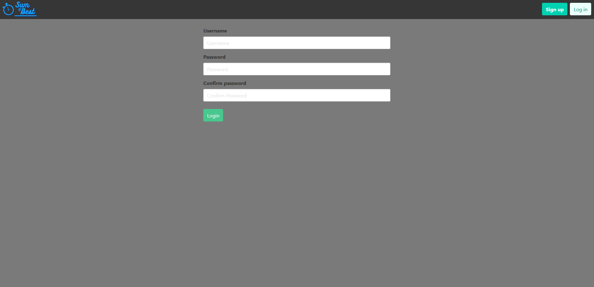
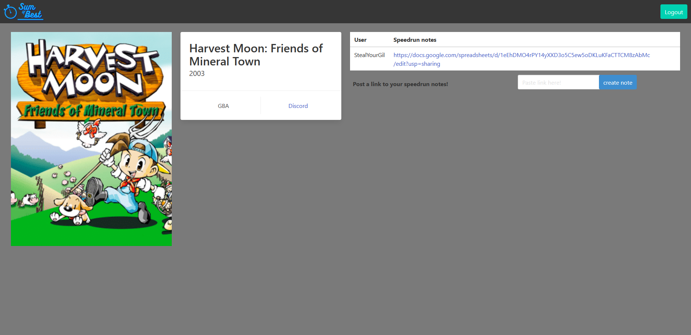

# Sum of Best

## Description

An application for the speed-running community to compare games and notes.

- The motivation to build this application, was to have a better way to share notes on speedruns.

- We built this project, to be able to better communicate with other runners.

- This application solves the problem of not having access to other peoples notes for runs.

- In this process, we learned the magic of backend.

## Table of Contents 

- [Installation](#installation)
- [Usage](#usage)
- [Screenshots](#screenshots)
- [Credits](#credits)

## Installation

run "npm i && start" in the terminal

## Usage

[deployed application](https://sum-of-best.herokuapp.com/)

## Technologies Used

Express, Node.js, Handlebars, MySql DB, Sequelize ORM, Sass, and Bulma

## Screenshots

## Credits

Find us on Github!

- [NTumminaro](https://github.com/NTumminaro)
- [v-tommi](https://github.com/v-tommi)
- [lindstdb](https://github.com/lindstdb)
- [TonyWorldChanger](https://github.com/TonyWorldChanger)

