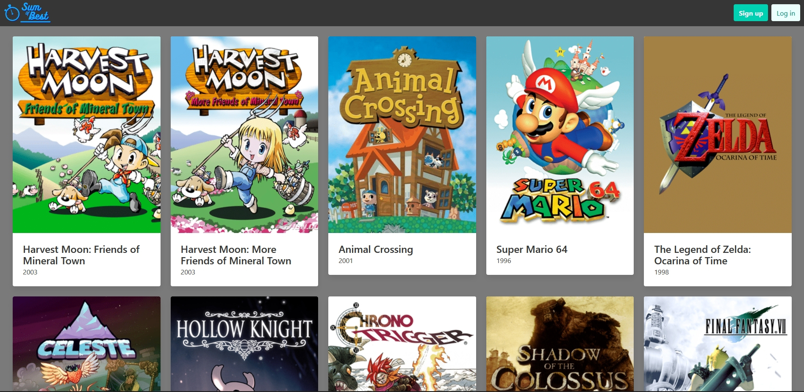

# Sum of Best

## Description

An application for the speed-running community to compare times and notes.

- The motivation to build this application, was to have a better way to share notes on speed-runs.

- We built this project, to be able to better communicate with other runners.

- This application solves the problem of not having access to other peoples notes about runs.

- In this process, we learned the magic of backend.

## Table of Contents 

- [Installation](#installation)
- [Usage](#usage)
- [Screenshots](#screenshots)
- [Credits](#credits)

## Installation

run "npm i && start" in the terminal

## Usage

Link to deployed application: https://sum-of-best.herokuapp.com/

## Technologies Used

Express, Node.js, Handlebars, MySql DB, Sequelize ORM, Bulma

## Screenshots

## Credits

Find us on Github!

Nick Tumminaro
NTumminaro

Tom Miyahira
v-tommi

Dillon Lindstrom
lindstdb

Tony Steverson
TonyWorldChanger

